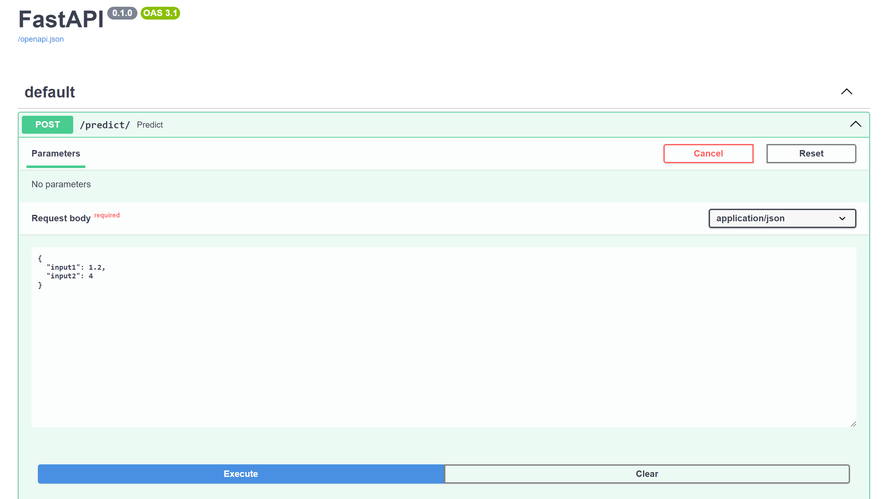
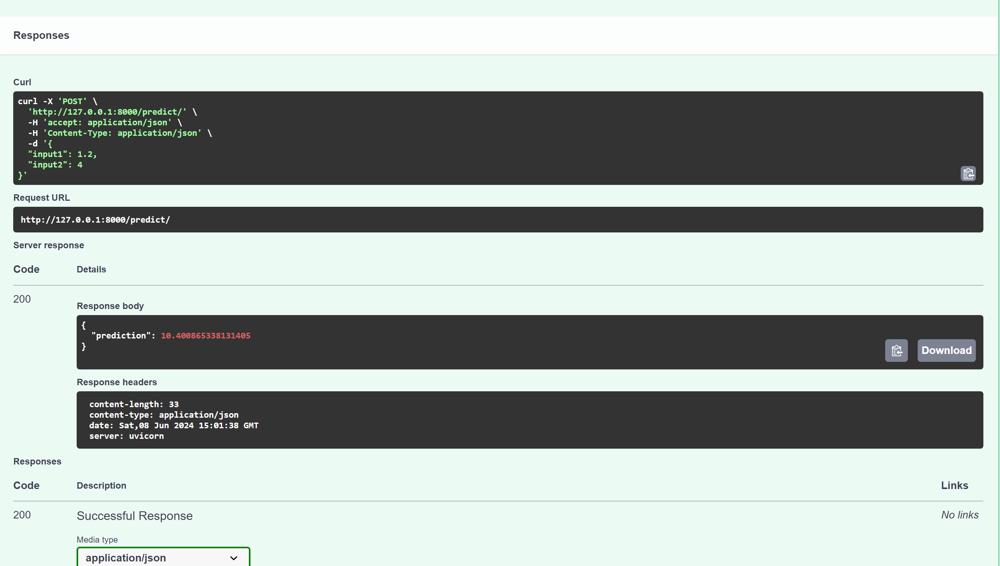

# fuel_consumption_model_using_FastAPI
This repository contains a fuel consumption prediction model built with FastAPI.
The model predicts vehicle fuel consumption based on various input parameters such as engine size, vehicle weight, and driving conditions.

Features
--FastAPI: A modern, fast (high-performance), web framework for building APIs with Python 3.7+ based on standard Python type hints.
--Machine Learning: Utilizes a pre-trained machine learning model to predict fuel consumption.
--Swagger UI: Automatically generated interactive API documentation.
--Pydantic: Data validation and settings management using Python type annotations.

